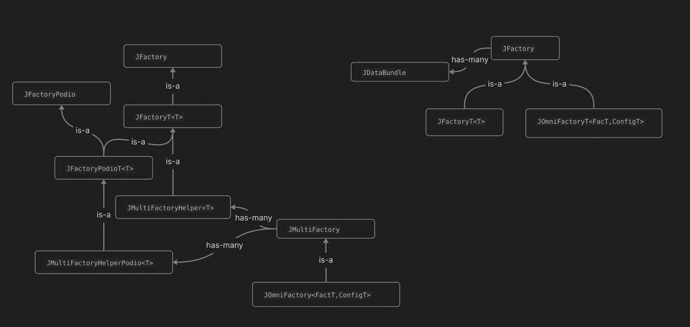

## Design Details

### JComponent

JComponent is the base class for most JANA2 interfaces that users are meant to implement, such as `JFactory` and `JEventProcessor`. JComponents all have:
- An `Init()` callback which is called sequentially during JApplication::Initialize()
- `Parameter` and `Service` declarations that JANA2 will inject before `Init()` is called
- A unique *parameter prefix* so that all parameters that belong to this component are given their own namespace
- A `JLogger` logger which is preconfigured before `Init()` is called, and accessed via `GetLogger()`
- A *logger group* name, which defaults to the parameter prefix. Thus each component's log levels can be changed individually, but this can be made less granular if desired
- The type name of the component
- The plugin name that provided the component

### JDatabundle

JDatabundle is JANA2's abstraction for all data input or output by a JComponent. Such data is roughly tabular, aka `awkward-array`-shaped. There are two distinct flavors: `lightweight` and `podio`, represented by `JLightweightDatabundle` and `JPodioDatabundle` respectively. Lightweight databundles contain a `std::vector<T*>` pointer, where `T` is fundamentally a plain `struct` which optionally inherits from `JObject`. Podio databundles, on the other hand, contain a pointer to a `podio::CollectionBase`.

Databundles are not required to own their contents -- Podio specifically forbids this. Lightweight databundles also do not own their contents, although this may be temporary, as this is mainly to assist in migrating away from the original design, where the contents of each databundle was wrapped by a unique JFactory instead. This new design allows a JFactory to have multiple outputs, and dramatically reduces the complexity of the machinery needed.

