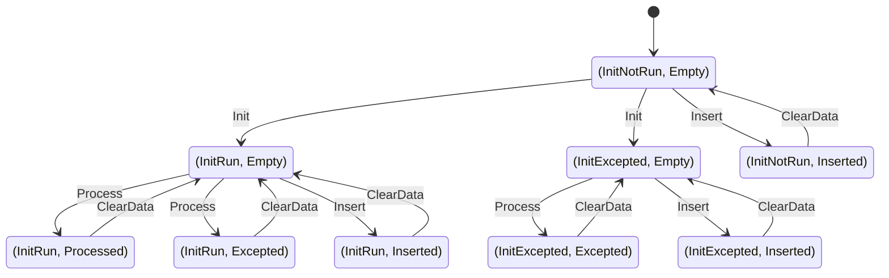
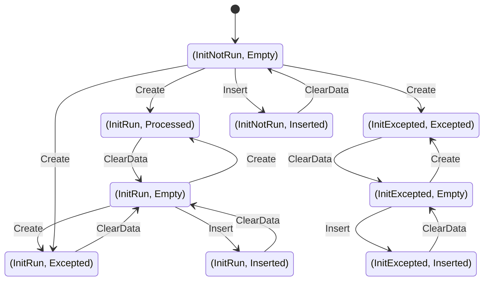

# Behavior specification

## Introduction

## Components

### JFactories

#### Callbacks

The user-defined callbacks are `Init`, `Process`, `BeginRun`, `EndRun`, and `Finish`. 

- `Init` is run at most once, and is used for loading and caching constant data. It is guaranteed to run before any call to `Process`.
  If `Process` is never called, e.g. because the data is `Insert`ed instead, then `Init` will not be called.

- `Finish` only runs if `Init` has ran, and is responsible for cleaning up and closing any state opened by `Init`.

- `BeginRun` runs after `Init` and before `Process`. It will only be called if the run number has been set, and this will be the first call to `Process` corresponding to that run number. 
  `BeginRun` is responsible for loading and caching data keyed off of the run number, e.g. conditions, calibrations, lookup tables, machine learning models.

- `EndRun` runs after a previously set run number gets changed. It runs after the last call to `Process` with that run number, and before the `BeginRun` for the new run number. 
  `EndRun` is responsible for cleaning up and closing any state opened by the previous call to `BeginRun`. `EndRun` is guaranteed to be called exactly once for each `BeginRun`, as long
  as JANA2 is shut down cleanly.

- `Process` is called exactly once for every JEvent. By the time `Process` is called, JANA2 guarantees that `Init` will have been called, followed by `BeginRun` if the run number has been set.

#### Activation
JFactories are lazy by design, which means that they won't be activated unless requested by another component. Activation is defined as calling `JFactory::Create` with a given JEvent, which
triggers the running of zero or more factory callbacks. Users are discouraged from calling `JFactory::Create` directly; instead, factories are usually activated via any of the following mechanisms:

- Declaring an `Input<T>` helper member variable on another JComponent.
- Calling `JEvent::Get*<T>()` or `JEvent::GetCollection<T>()`
- Setting the parameter `jana:autoactivate=$DATABUNDLE_NAME`. This will activate the factory even though its results are never used downstream, which is mainly useful for debugging.

#### Exception handling
JFactory's user-defined methods are allowed to throw exceptions. Unlike other JANA2 components, throwing an exception here does not immediately terminate processing -- the
user has the opportunity to catch the exception in the caller. For instance, calls to `JEvent::Get*` may be wrapped in a try-catch block. The exception itself is wrapped in a `JException` which preserves
stack trace and component information. If a factory callback excepts, the exception is stored so that it can be re-thrown on future calls. The excepting callback will only be called once. If any
callbacks except, JANA2 will still store the contents of each `Output` helper's transient output buffer. This means that if `Process` excepts, all data inserted prior to the exception will be preserved.

#### State machine

The JFactory state machine is defined as follows. The state has two components, `InitStatus` and `Status`. `InitStatus <- {NotRun, Run, Excepted}`, which allows `JFactory::Create` to guarantee that
`Init` gets called at most once, even when some events have the factory data `Insert`ed and others let it be `Processed`. `Status <- {Empty, Processed, Inserted, Excepted}` captures what exactly
is in cache. `Empty` is the only state where no data has been cached/stored; `Excepted` means that an empty or partial collection was stored. This storage operation is guaranteed to happen exactly once 
per activated factory per event, a requirement imposed by Podio's write-exactly-once semantics. The following transition diagram shows the relationship between valid states and transitions corresponding 
to factory callbacks.

Note that many of these transitions are encapsulated behind `JFactory::Create`. The only operations available to the user are `Create` (i.e. activate), `Insert`, and `ClearData`. 
Redrawing the state diagram in terms of these transitions gives us:

Although not shown for the sake of visual clarity, it is important to note that `Create` operations are idempotent, so all of the `Status:Inserted`, `Status:Processed`, and `Status:Excepted` states
have implicit `Create` transitions pointing back to themselves. Correspondingly, the `Status:Empty` states have `ClearData` transitions pointing back to themselves. However, the `Status:Inserted` states 
do _not_ have `Insert` transitions pointing back to themselves. Multiple `Insert` operations are disallowed due to the write-once constraint.

## Execution Engine

### Engine initialization

If no `JEventSources` are present in the processing topology, `JApplication::Initialize()` will still succeed, and all present components will be initialized.

### Engine operation

If no `JEventSources` are present in the processing topology, `JExecutionEngine::Run()` will immediately throw a detailed `JException`. This will terminate `JApplication::Run()` and cause `JMain::Execute()` to exit the program.

### Factory auto activation
The `JAutoActivator` plugin, when enabled by setting the `autoactivate` parameter, always runs before the other `PhysicsEvent`-level JEventProcessors`. `JAutoActivator` calls the corresponding `JFactory::Create` for each data bundle in the `autoactivate` list, in the order provided.

### Max in-flight events
The number of in-flight events is controlled by the `jana:max_inflight_events` parameter, and defaults to the same value as the `nthreads` parameter. JANA2 will create this many `JEvents` in the pool at each `JEventLevel`. Increasing the number of in-flight events means more available tasks and hence better utilization of the worker threads, at the expense of more memory usage and longer startup time.

### Timeout
The execution engine will optionally enforce a timeout on arrow execution. If the timeout is exceeded, the supervisor will throw an exception, which will end all processing. The timeout duration is controlled by the `jana:timeout` and `jana:warmup_timeout` parameters. The warmup timeout exists because factories' `BeginRun` callback might take a long time when the event is used for the first time, for instance connecting to external resources such as calibration databases. The execution engine will decide whether to enforce the warmup timeout vs the general timeout by checking the `JEvent::IsWarmedUp` flag. This flag is initially set to false and is set to true once it has been processed successfully exactly once, as determined via `JEvent::Finish`.

