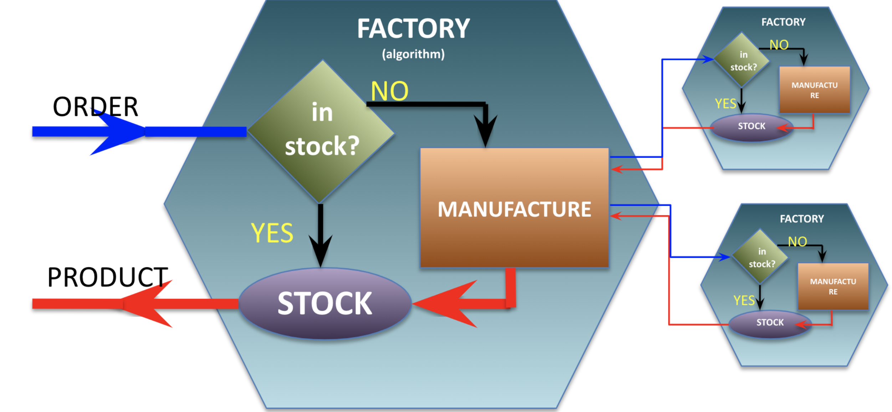
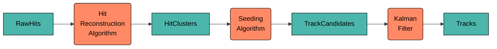
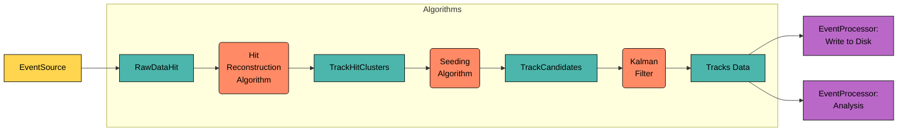
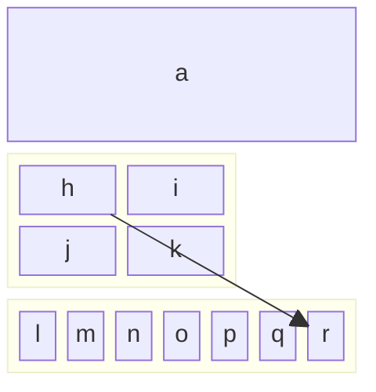

# JANA2 Concepts

## Core Architecture

At its core, JANA2 views data processing as a chain of transformations, 
where algorithms are applied to data to produce more refined data. 
This process is organized into two main layers:

1. **Queue-Arrow Mechanism:** JANA2 utilizes the [arrow model](https://en.wikipedia.org/wiki/Arrow_\(computer_science\)), 
   where data starts in a queue. An "arrow" pulls data from the queue, processes it with algorithms, 
   and places the processed data into another queue. The simplest setup involves input and output queues 
   with a single arrow handling all necessary algorithms. But JANA2 supports more complex configurations 
   with multiple queues and arrows chained together, operating sequentially or in parallel as needed.

2. **Algorithm Management within Arrows:** Within each arrow, JANA2 organizes and manages algorithms along with their
  inputs and outputs, allowing flexibility in data processing. Arrows can be configured to distribute the processing
  load across various algorithms. By assigning threads to arrows, JANA2 leverages modern hardware to process data 
  concurrently across multiple cores and processors, enhancing scalability and efficiency.

In organizing, managing, and building the codebase, JANA2 provides:

- **Algorithm Building Blocks:** Essential components like Factories, Processors, Services and others, 
  help write, organize and manage algorithms. These modular units can be configured and combined to construct 
  the desired data processing pipelines, promoting flexibility and scalability.

- **Plugin Mechanism:** Orthogonal to the above, JANA2 offers a plugin mechanism to enhance modularity and flexibility. 
  Plugins are dynamic libraries with a specialized interface, enabling them to register components with the main application.
  This allows for dynamic runtime configuration, selecting or replacing algorithms and components without recompilation,
  and better code organization and reuse. Large applications are typically built from multiple plugins, 
  each responsible for specific processing aspects. Alternatively, monolithic applications without plugins 
  can be created for simpler, smaller applications.

## Algorithms

The data analysis application flow can be viewed as a chain of algorithms that transform input data into the 
desired output. A simplified example of such a chain is shown in the diagram below:

In this example, for each event, raw ADC values of hits are processed: 
first combined into clusters, then passed into track-finding and fitting algorithms, 
with the resulting tracks as the chain's output. In real-world scenarios, 
the actual graph is significantly more complex and requires additional components such as Geometry, 
magnetic field maps, calibrations, alignments, etc. 
Additionally, some algorithms are responsible not only for processing objects in memory 
but also for tasks such as reading data from disk or DAQ streams 
and writing reconstructed data to a destination. 
A more realistic and complex flow can be represented as follows:

To give very brief overview algorithm building blocks, how this flow is organized in JANA2 : 

- **JFactory** - This is the primary component for implementing algorithms (depicted as orange boxes). 
  JFactories compute specific results on an event-by-event basis. 
  Their inputs may come from an EventSource or other JFactories. 
  Algorithms in JFactories can be implemented using either Declarative or Imperative approaches 
  (described later in the documentation).

- **JEventSource** - A special type of algorithm responsible for acquiring raw event data, 
  and exposes it to JANA for subsequent processing. For example reading events from a file or listening 
  to DAQ messaging producer which provides raw event data.  

- **JEventProcessor** - Positioned at the top of the calculation chain, JEventProcessor is designed 
  to collect data from JFactories and handle end-point processing tasks, such as writing results to 
  an output file or messaging consumer. However, JEventProcessor is not limited to I/O operations; 
  it can also perform tasks like histogram plotting, data quality monitoring, and other forms of analysis.

  To clarify the distinction: JFactories form a lazy directed acyclic graph (DAG), 
  where each factory defines a specific step in the data processing chain. 
  In contrast, the JEventProcessor algorithm is executed for each event. 
  When the JEventProcessor collects data, it triggers the lazy evaluation of the required factories, 
  initiating the corresponding steps in the data processing chain.

- **JService** - Used to store resources that remain constant across events, such as Geometry descriptions, 
 Magnetic Field Maps, and other shared data. Services are accessible by both algorithms and other services.

We now may redraw the above diagram in terms of JANA2 building blocks:

### Implementing algorithms

We start with how the algorithms are implemented in JANA2, what is this data, 
that flows between the algorithms and how those algorithms may be wired together.

If we look at algorithms in very general way, each algorithm may have several types
of resources it needs to operate: 

- 

JANA2 allows users to define algorithms in two different approaches: 

- **Declarative Approach** - When resources required for algorithms to run are explicitly declared in class body.  
- **Imperative Approach** - When algorithm can dynamically deside what it needs and even, maybe, what it produces. 

#### Declarative Approach

Each algorithm should explicitly declare what 

### Declarative way

JANA2 call those algorithms to calculate specific results on an event-by-event basis. 
Algorithms are decoupled from one another. One can think of algorithms in declarative or imperative ways. JFactory supports both!

### Data

JANA2 alows users to define and select their own event models, 
providing the flexibility to design data structures to specific experimental needs. Taking the above 
diagram as an example, classes such as `RawHits`, `HitClusters`, ... `Tracks` might be just a user defined classes. 

JANA2 offers extended support for PODIO (Plain Old Data Input/Output) to facilitate standardized data handling, 
it does not mandate the use of PODIO or even ROOT. This ensures that users can choose the most suitable data management 
tools for their projects without being constrained by the framework.

## JANA concepts

- JObjects are data containers for specific resuts, e.g. clusters or tracks. They may be plain-old structs or they may
optionally inherit from (e.g.) ROOT or NumPy datatypes. 

- JEventSources take a file or messaging producer which provides raw event data, and exposes it to JANA as a stream.

- JFactories calculate a specific result on an event-by-event basis. Their inputs may come from an EventSource or may
be computed via other JFactories. All results are evaluated lazily and cached until the entire event is finished processing.
in order to do so. Importantly, JFactories are decoupled from one another via the JEvent interface. It should make no
difference to the JFactory where its input data came from, as long as it has the correct type and tag. While the [Factory 
Pattern](https://en.wikipedia.org/wiki/Factory_method_pattern) usually abstracts away the _subtype_ of the class being 
created, in our case it abstracts away the _number of instances_ created instead. For instance, a ClusterFactory may 
take m Hit objects and produce n Cluster objects, where m and n vary per event and won't be known until that
 event gets processed. 

- JEventProcessors run desired JFactories over the event stream and write the results to an output file or messaging
consumer. JFactories form a lazy directed acyclic graph, whereas JEventProcessors trigger their actual evaluation. 

## Object lifecycles

It is important to understand who owns each JObject and when it is destroyed.

By default, a JFactory owns all of the JObjects that it created during `Process()`. Once all event processors have 
finished processing a `JEvent`, all `JFactories` associated with that `JEvent` will clears and delete their `JObjects`. 
However, you can change this behavior by setting one of the factory flags:

* `PERSISTENT`: Objects are neither cleared nor deleted. This is usually used for calibrations and translation tables.
 Note that if an object is persistent, `JFactory::Process` will _not_ be re-run on the next `JEvent`. The user  
 may still update the objects manually, via `JFactory::BeginRun`, and must delete the objects manually via 
 `JFactory::EndRun` or `JFactory::Finish`. 
 
* `NOT_OBJECT_OWNER`: Objects are cleared from the `JFactory` but _not_ deleted. This is useful for "proxy" factories 
 (which reorganize objects that are owned by a different factory) and for `JEventGroups`. `JFactory::Process` _will_ be
 re-run for each `JEvent`. As long as the objects are owned by a different `JFactory`, the user doesn't have to do any 
 cleanup.
 
The lifetime of a `JFactory` spans the time that a `JEvent` is in-flight. No other guarantees are made: `JFactories` might
be re-used for multiple `JEvents` for the sake of efficiency, but the implementation is free to _not_ do so. In particular,
the user must never assume that one `JFactory` will see the entire `JEvent` stream.

The lifetime of a `JEventSource` spans the time that all of its emitted `JEvents` are in-flight. 

The lifetime of a `JEventProcessor` spans the time that any `JEventSources` are active.

The lifetime of a `JService` not only spans the time that any `JEventProcessors` are active, but also the lifetime of 
`JApplication` itself. Furthermore, because JServices use `shared_ptr`, they are allowed to live even longer than 
`JApplication`, which is helpful for things like writing test cases.

