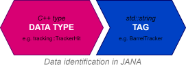
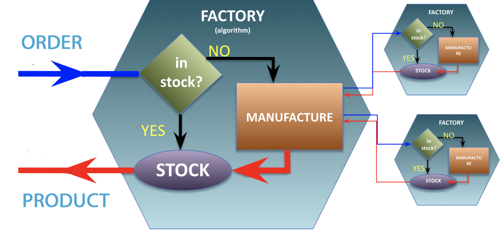
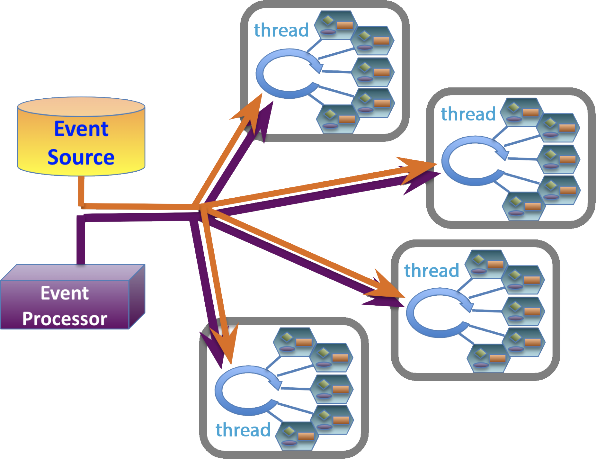

# JANA2 Concepts


## Core Architecture


At its core, JANA2 views data processing as a chain of transformations, 
where algorithms are applied to data to produce more refined data. 
This process is organized into two main layers:

1. **Queue-Arrow Mechanism:** JANA2 utilizes the [arrow model](https://en.wikipedia.org/wiki/Arrow_\(computer_science\)), 
   where data starts in a queue. An "arrow" pulls data from the queue, processes it with algorithms, 
   and places the processed data into another queue. The simplest setup involves input and output queues 
   with a single arrow handling all necessary algorithms. But JANA2 supports more complex configurations 
   with multiple queues and arrows chained together, operating sequentially or in parallel as needed.

   

2. **Algorithm Management within Arrows:** Within each arrow, JANA2 organizes and manages algorithms along with their
  inputs and outputs, allowing flexibility in data processing. Arrows can be configured to distribute the processing
  load across various algorithms. By assigning threads to arrows, JANA2 leverages modern hardware to process data 
  concurrently across multiple cores and processors, enhancing scalability and efficiency.

In organizing, managing, and building the codebase, JANA2 provides:

- **Algorithm Building Blocks:** Essential components like Factories, Processors, Services and others, 
  help write, organize and manage algorithms. These modular units can be configured and combined to construct 
  the desired data processing pipelines, promoting flexibility and scalability.

- **Plugin Mechanism:** Orthogonal to the above, JANA2 offers a plugin mechanism to enhance modularity and flexibility. 
  Plugins are dynamic libraries with a specialized interface, enabling them to register components with the main application.
  This allows for dynamic runtime configuration, selecting or replacing algorithms and components without recompilation,
  and better code organization and reuse. Large applications are typically built from multiple plugins, 
  each responsible for specific processing aspects. Alternatively, monolithic applications without plugins 
  can be created for simpler, smaller applications.


## Building blocks

While the above concepts are important in terms of how JANA2 works under the hud, the most  
of the time spent by regular users (scientist) is usually spent in writing and tuning their 
reconstruction and analysis algorithms, Which means most of the time working with  
JANA2 building blocks such as Factories, Processors, EventSources and several others. 

The data analysis application flow can be viewed as a chain of algorithms that transform input data into the 
desired output. A simplified example of such a chain is shown in the diagram below:


In this example, for each event, raw ADC values of hits are processed: 
first combined into clusters, then passed into track-finding and fitting algorithms, 
with the resulting tracks as the chain's output. In real-world scenarios, 
the actual graph is significantly more complex and requires additional components such as Geometry, 
magnetic field maps, calibrations, alignments, etc. 
Additionally, some algorithms are responsible not only for processing objects in memory 
but also for tasks such as reading data from disk or DAQ streams 
and writing reconstructed data to a destination. 
A more realistic and complex flow can be represented as follows:


To give very brief overview algorithm building blocks, how this flow is organized in JANA2 : 

- **JFactory** - This is the primary component for implementing algorithms (depicted as orange boxes). 
  JFactories compute specific results on an event-by-event basis. 
  Their inputs may come from an EventSource or other JFactories. 
  Algorithms in JFactories can be implemented using either Declarative or Imperative approaches 
  (described later in the documentation).

- **JEventSource** - A special type of algorithm responsible for acquiring raw event data, 
  and exposes it to JANA for subsequent processing. For example reading events from a file or listening 
  to DAQ messaging producer which provides raw event data.  

- **JEventProcessor** - Positioned at the top of the calculation chain, JEventProcessor is designed 
  to collect data from JFactories and handle end-point processing tasks, such as writing results to 
  an output file or messaging consumer. However, JEventProcessor is not limited to I/O operations; 
  it can also perform tasks like histogram plotting, data quality monitoring, and other forms of analysis.

  To clarify the distinction: JFactories form a lazy directed acyclic graph (DAG), 
  where each factory defines a specific step in the data processing chain. 
  In contrast, the JEventProcessor algorithm is executed for each event. 
  When the JEventProcessor collects data, it triggers the lazy evaluation of the required factories, 
  initiating the corresponding steps in the data processing chain.

- **JService** - Used to store resources that remain constant across events, such as Geometry descriptions, 
 Magnetic Field Maps, and other shared data. Services are accessible by both algorithms and other services.

- **JApplication** - The JApplication class is the central hub of the JANA2 framework, managing the initialization, 
  configuration, and execution of the data processing workflow while providing access to key managers, services, 
  and runtime controls. Typically, a single JApplication instance is created at the start of the application 
  and manages all phases, including initialization, configuration, execution, and shutdown

We now may redraw the above diagram in terms of JANA2 building blocks:


JFactory, JEventSource, and JEventProcessor share a common purpose in that all are designed to implement specific algorithms.
However, they serve distinct roles within the framework. 
While detailed explanations are provided later, here is a brief comparison:

- **JFactory**: Responsible for taking objects from memory and producing new objects in memory. 
  JFactories are multithreaded, processing events in parallel. They are invoked lazily - only when a specific object is needed by another component.

- **JEventProcessor**: Processes objects from memory without producing new objects: analyzes them or writes results to disk. 
  Users can specify to run specific JEventProcessors multithreaded or in a single thread. The latter is designed to simplifies 
  resource management for operations like writing to disk. 

- **JEventSource**: Reads data from an external I/O source (such as disk, network, or simulation) and populates objects into memory. 
  JEventSources are designed to read events or blocks of events. Operates in a single-threaded manner.


## Data model

JANA2 alows users to define and select their own event models,
providing the flexibility to design data structures to specific needs of an experiment. Taking the above
diagram as an example, classes such as `RawHits`, `HitClusters`, ... `Tracks` might be just a user defined classes.
The data structures can be as simple as:

```cpp
struct GenericHit {
double x,y,z, edep;
};
```

A key feature of JANA2 is that it doesn't require data to inherit from any specific base class, 
such as JObject (used in JANA1) or ROOT's TObject. 
While your data classes can inherit from other classes if your data model requires it, 
JANA2 remains agnostic about this. 

JANA2 offers extended support for PODIO (Plain Old Data Input/Output) to facilitate standardized data handling,
it does not mandate the use of PODIO or even ROOT. This ensures that users can choose the most suitable data management
tools for their projects without being constrained by the framework.

### Data Identification in JANA2



An important aspect is how data is identified within JANA2. JANA2 supports two identifiers:

1. **Data Type**: The C++ type of the data, e.g., `GenericHit` from the above example.
2. **Tags**: A string identifier in addition to type. 

The concept of tags is useful in several scenarios. For instance:
- When multiple factories can produce the same type of data e.g. utilizing different underlying algorithms. 
  By specifying the tag name, you can select which algorithm's output you want.
- To reuse the same type. E.g. You might have `GenericHit` data with tags 
  `"VertexTracker"` and `"BarrelTracker"` to distinguish between hits from different detectors. Or
  type `Particle` with tags `"TrueMcParticles"` and `"ReconstructedParticles"` 

Depending on your data model and the types of factories used (described below), 
you can choose different strategies for data identification:

- **Type-Based Identification**: Fully identify data only by its type name, keeping the tag empty most of the time. 
  Use tags only to identify alternative algorithms. This approach is used by GlueX.
- **Tag-Based Identification**: Use tags as the main data identifier and deduce types automatically whenever possible.
  This approach is used in PODIO data model and EIC reconstruction software.


## Factories

We start with how the algorithms are implemented in JANA2, what is the data, 
that flows between the algorithms and how those algorithms may be wired together.

JANA implements a **factory model**, where data objects are the products, and the algorithms that generate them are the 
factories. While there are various types of factories in JANA2 (covered later in this documentation), 
they all follow the same fundamental concept:



This diagram illustrates the analogy to industry. When a specific data object is requested for the current event in JANA, 
the framework identifies the corresponding algorithm (factory) capable of producing it. 
The framework then checks if the factory has already produced this data for the current event 
(i.e., if the product is "in stock"). 

- If the data **is already available**, it is retrieved and returned to the user.
- **If not**, the factory is invoked to produce the required data, and the newly generated data is returned to the user.

To create the requested data, factories may need lower-level objects, 
triggering requests to the corresponding factories. It continues until all required factories have been 
invoked and the entire chain of dependent objects has been produced.

In other words, JANA2 factories form a lazily evaluated directed acyclic graph
\([DAG](https://en.wikipedia.org/wiki/Directed_acyclic_graph)\) of data creation, 
where all the produced data is cached until the entire event is finished processing.
Thus factories produce its objects only once for a given event making it efficient when the 
same data is required from multiple algorithms.


### Multithreading and factories

In context of factories it is important to at least briefly mention how they work
in terms of multithreading (much more details on it further)

In JANA2, each thread has its own complete and independent set of factories capable of
fully reconstructing an event within that thread. This minimizes the use of locks which would be required
to coordinate between threads and subsequently degrade performance. Factory sets are maintained in a pool and
are (optionally) assigned affinity to a specific NUMA group.




With some level of simplification, this diagram shows how sets of factories are created for each thread in the
working pool. Limited by IO operations, events usually must be read in from the source sequentially(orange)
and similarly written sequentially to the output(violet).

### Imperative vs Declarative factories

How the simplest factory looks in terms of code? Probably the simplest would be JFactory<T>

```cpp
// MyCluster - is what this factory outputs
class ExampleFactory : public JFactoryT<MyCluster> {
public:   
    void Init() override { /* ... initialize what is needed */ }    
    
    void Process(const std::shared_ptr<const JEvent> &event) override 
    {   
        auto hits = event->Get<MyHit>();   // Request data of type MyHit from JANA
        std::vector<MyCluster*> clusters;        
        for(auto hit: hits) {// ...        // Produce clusters from hits  
        Set(clusters);                     // Set the output data
    }
};
```

The above code gives a glimpse into how such an algorithm or factory might look. 
In later sections, we will explore the methods, their details, and other components that can be utilized.

What’s important to note in this example is that `JFactory<T>` follows the ***Imperative Approach***. 
In this approach, the factory is provided with the `JEvent` interface, which it used to dynamically request
the data required by the algorithm as needed. 

JANA2 supports two distinct approaches for defining algorithms:

- **Imperative Approach**: The algorithm determines dynamically what data it needs and requests 
  it through the JEvent interface.

- **Declarative Approach**: The algorithm explicitly declares its required inputs and outputs upfront
  in the class definition.
- 
For instance, the declarative approach can be implemented using `JOmniFactory<T>`. 
Here's how the same factory might look when following the declarative approach:

```cpp
class ExampleFactory : public JOmniFactory<ExampleFactory> {
public: 

    Input<MyHit> hits {this};              // Declare intputs
    Output<MyCluster> clusters {this};     // Declare what factory produces
    
    void Configure() override { /* ... same as Init() in JFactory */ }    
    
    void Execute(int32_t run_number, int32_t event_number) override 
    {   
        // It is ensured that all inputs are ready, when Execute is called. 
        for(auto hit: hits()) {// ...        // Produce clusters from hits  
        
        clusters() = std::move(clusters)     // Set the output data
    }
};
```

Declarative factories excel in terms of code management and clarity. 
The declarative approach makes it immediately clear what an algorithm's inputs are and what it produces. 
While this advantage may not be obvious in the above simple example, it becomes particularly evident when dealing 
with complex algorithms that have numerous inputs, outputs, and configuration parameters. 
For instance, consider a generic clustering algorithm that could later be adapted for various calorimeter detectors.

In general, it is recommended to follow the declarative approach unless the dynamic flexibility 
of imperative factories is explicitly required.

As a good example scenario where the imperative approach is preferred is in software Level-3 (L3) triggers. 
The imperative approach allows for highly efficient implementations of L3 (i.e., high-level) triggers. 
A decision-making algorithm could be designed to request low-level objects first 
to quickly determine whether to accept or reject an event. If the decision cannot be made using the low-level objects, 
the algorithm can request higher-level objects for further evaluation. 
This ability to dynamically activate factories on an event-by-event basis optimizes the L3 system’s throughput, 
reducing the computational resources required to implement it.

### Factory types

Main factory types in JANA2 are: 

- `JFactory` - imperative factory with a single output type
- `JMultifactory` - imperative factory that can produce several types at once
- `JOmniFactory` - declarative factory with multiple outputs. 

<table> 
<tr>
<th></th>
<th>Declarative</th>
<th colspan="2">Imperative</th>
</tr>
<tr>
<th></th>
<th>JOmniFactory</th>
<th>JFactory</th>
<th>JMultifactory</th>
</tr>

<tr>
<td>Inputs</td>
<td>Fixed number of input types</td>
<td colspan="2">Any number of input types</td>
</tr>

<tr>
<td>Input requests</td>
<td>Declared upfront in class definition</td>
<td colspan="2">Requested dynamically through JEvent interface</td>
</tr>

<tr>
<td>Outputs</td>
<td>Multiple types/outputs</td>
<td>Single type</td>
<td>Multiple types</td>
</tr>

<tr>
<td>Outputs declaration</td>
<td>Declared upfront in class definition</td>
<td>Declared in class definition</td>
<td>Must be declared in constructor</td>
</tr>

</table>


### Declarative Factories

```cpp

/// A factory should be inherited from JOmniFactory<T> 
/// where T should be the factory class itself (CRTP)  
struct HitRecoFactory : public JOmniFactory<HitRecoFactory> {

   /// "Output-s" is what data produced.
   Output<HitCluster> m_clusters{this};
   
   /// "Input-s" is the data that factory uses to produce result 
   Input<McHit> m_mcHits{this};
   
   /// Additional service needed to produce data
   Service<CalibrationService> m_calibration{this};
   
   /// Parameters are values, that can be changed from command line
   Parameter<bool> m_cfg_use_true_pos{this, "hits:min_edep_cut", 100, "Flag description"};

   /// Configure is called once, to configure the algorithm
   void Configure() {  /* ... */ }

   /// Called when processing run number is changed 
   void ChangeRun(int32_t run_number) { /* ... get calibrations for run ... */ }

   /// Called for each event
   void Execute(int32_t /*run_nr*/, uint64_t event_index) 
   {
      auto result = std::vector<HitCluster*>();  
      for(auto hit: m_mcHits()) {   // get input data from event source or other factories
         // ... produce clusters from hits
      }
      
      // 
      m_clusters() = std::move(result);
   }

``` 

### Factory generators

Since every working thread creates its set of factory, besides factories code one has to provide a way 
how to create a factory. I.e. provide a factory generator class. Fortunately, JANA2 provides a templated
generic FactoryGeneratorT code that work for the majority of cases:

```cpp
// For JFactories

// For JOmniFactories
```


## JApplication

The [JApplication](https://jeffersonlab.github.io/JANA2/refcpp/class_j_application.html)
class is the central hub of the JANA2 framework, orchestrating all aspects of a JANA2-based
application. It manages the initialization, configuration, and execution of the data processing workflow,
serving as the entry point for interacting with the core components of the system.
By providing access to key managers, services, and runtime controls,
JApplication ensures that the application operates smoothly from setup to shut down.
To illustrate this, here is a code of a typical standalone JANA2 application:

```cpp
int main(int argc, char* argv[]) {

    auto params = new JParameterManager();
    // ...  usually some processing of argv here adding them to JParameterManager

    // Instantiate the JApplication with the parameter manager    
    JApplication app(params);

    // Add predefined plugins
    app.AddPlugin("my_plugin");
    
    // Register services:
    app.ProvideService(std::make_shared<LogService>());
    app.ProvideService(std::make_shared<GeometryService>());

    // Register components
    app.Add(new JFactoryGeneratorT<MyFactoryA>);
    app.Add(new JFactoryGeneratorT<MyFactoryB>);
    app.Add(new JEventSourceGeneratorT<MyEventSource>);
    app.Add(new MyEventProcessor());

    // Initialize and run the application
    app.Initialize();
    app.Run();

    // Print the final performance report
    app.PrintFinalReport();

    // Retrieve and return the exit code
    return app.GetExitCode();
}
```


## Plugins

In JANA2, plugins are dynamic libraries that extend the functionality of the main application by registering 
additional components such as event sources, factories, event processors, and services. 
Plugins are a powerful mechanism that allows developers to modularize their code, promote code reuse, 
and configure applications dynamically at runtime without the need for recompilation.

For a library to be recognized as a plugin, it must implement a specific initialization function called 
`InitPlugin()` with C linkage. The function is called by JANA when plugins are loaded and should be used 
for registering the plugin's components with the JApplication instance.

```cpp
extern "C" {
    void InitPlugin(JApplication* app) {
        InitJANAPlugin(app);
        // Register components: 
        app->Add(/** ... */);    // add components from this plugin 
        app->Add(/** ... */); 
        // ...    
    }
}
```

### How Plugins Are Found and Loaded

When a JANA2 application starts, it searches for plugins in specific directories. 
The framework maintains a list of plugin search paths where it looks for plugin libraries. 
By default, this includes directories such as:

- The current working directory.
- Directories specified by the `JANA_PLUGIN_PATH` environment variable.
- Directories added programmatically via the `AddPluginPath()` method of `JApplication`.

Plugins are loaded in two main ways:

- **Automatic Loading**: The application can be configured to load plugins specified by 
  command-line arguments or configuration parameters via `-Pplugins` flag.

  ```bash
  ./my_jana_application -Pplugins=MyPlugin1,AnotherPlugin
  ```

- **Programmatic Loading**: Plugins can be loaded explicitly in the application code 
  by calling the `AddPlugin()` method of `JApplication`.

### Plugins debugging

JANA2 provides a very handy parameter `jana:debug_plugin_loading=1` which will print 
the detailed information on the process of plugin loading. 


## Object lifecycles

It is important to understand who owns each JObject and when it is destroyed.

By default, a JFactory owns all of the JObjects that it created during `Process()`. Once all event processors have 
finished processing a `JEvent`, all `JFactories` associated with that `JEvent` will clears and delete their `JObjects`. 
However, you can change this behavior by setting one of the factory flags:

* `PERSISTENT`: Objects are neither cleared nor deleted. This is usually used for calibrations and translation tables.
 Note that if an object is persistent, `JFactory::Process` will _not_ be re-run on the next `JEvent`. The user  
 may still update the objects manually, via `JFactory::BeginRun`, and must delete the objects manually via 
 `JFactory::EndRun` or `JFactory::Finish`. 
 
* `NOT_OBJECT_OWNER`: Objects are cleared from the `JFactory` but _not_ deleted. This is useful for "proxy" factories 
 (which reorganize objects that are owned by a different factory) and for `JEventGroups`. `JFactory::Process` _will_ be
 re-run for each `JEvent`. As long as the objects are owned by a different `JFactory`, the user doesn't have to do any 
 cleanup.
 
The lifetime of a `JFactory` spans the time that a `JEvent` is in-flight. No other guarantees are made: `JFactories` might
be re-used for multiple `JEvents` for the sake of efficiency, but the implementation is free to _not_ do so. In particular,
the user must never assume that one `JFactory` will see the entire `JEvent` stream.

The lifetime of a `JEventSource` spans the time that all of its emitted `JEvents` are in-flight. 

The lifetime of a `JEventProcessor` spans the time that any `JEventSources` are active.

The lifetime of a `JService` not only spans the time that any `JEventProcessors` are active, but also the lifetime of 
`JApplication` itself. Furthermore, because JServices use `shared_ptr`, they are allowed to live even longer than 
`JApplication`, which is helpful for things like writing test cases.


