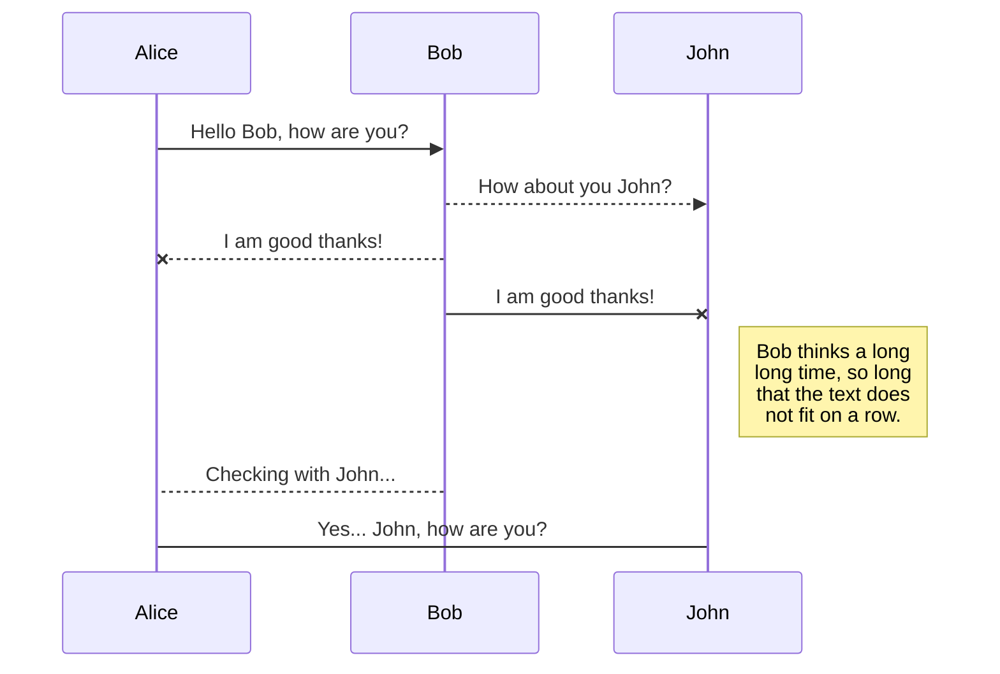

## Mermaid diagrams

One way to use [Mermaid diagrams](https://mermaid.js.org) in the documentation: 

<pre>

</pre>


The other one is by using `<pre class="mermaid">` HTML tags: 

```html
<pre class="mermaid">
    graph LR
    A --- B
    B-->C[fa:fa-ban forbidden]
    B-->D(fa:fa-spinner);
</pre>
```

<pre class="mermaid">
    graph LR
    A --- B
    B-->C[fa:fa-ban forbidden]
    B-->D(fa:fa-spinner);
</pre>

